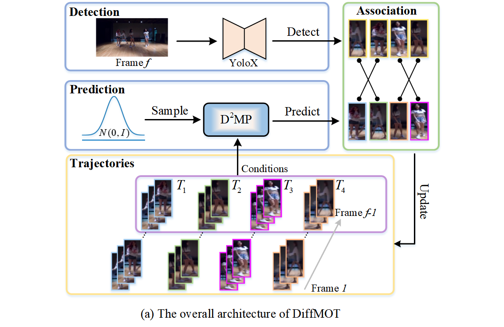
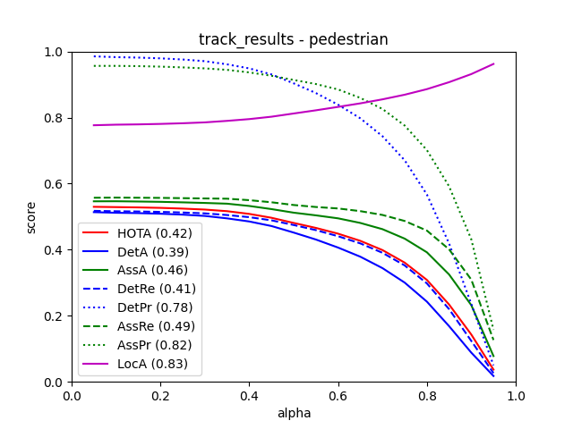
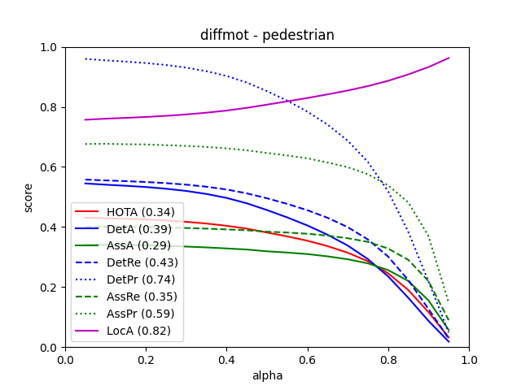
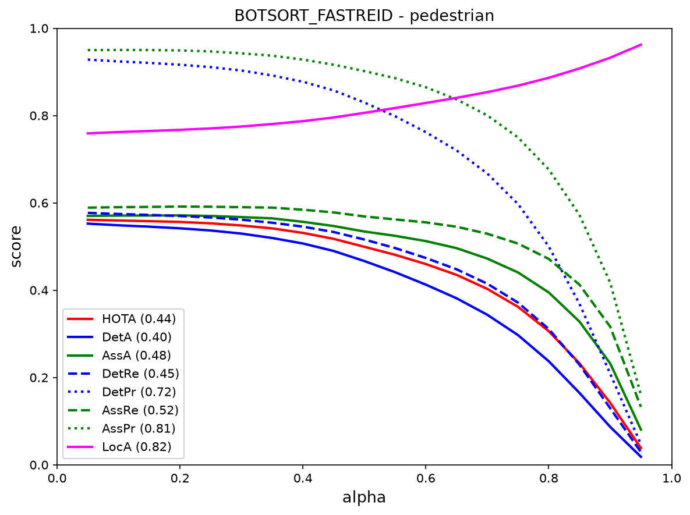

# VIDEOTRACKING

A comparative study of **classical**, **diffusion-based**, and **appearance-based** multi-object tracking on the MOT17 benchmark dataset. The repository contains three complete pipelines: YOLOv8 + Kalman Filter, YOLOv8 + Diffusion Model, and YOLOv8 + BoTSORT with FastReID SBS-S50 ReID backbone (ResNeSt50).

---

## Projects Overview

| | KALMAN-YOLO | DiffMOT-main | BoTSORT + FastReID |
|---|---|---|---|
| **Detection** | YOLOv8n | YOLOv8n | YOLOv8n |
| **Tracking** | Kalman Filter | Diffusion Model (D²MP) | BoTSORT with FastReID SBS-S50 ReID (ResNeSt50) |
| **Dataset** | MOT17 (7 sequences) | MOT17 (7 sequences) | MOT17 (7 sequences) |
| **Evaluation** | TrackEval (HOTA, CLEAR, Identity) | TrackEval (HOTA, CLEAR, Identity) | TrackEval (HOTA, CLEAR, Identity) |

---

## Repository Structure

Only files tracked in Git are shown below. Datasets (images, gt), model weights, cloned libraries, and cache are git-ignored.

```
VIDEOTRACKING/
├── README.md
│
├── BOTSORT-FASTREID/                   # BoTSORT + FastReID SBS-S50 pipeline
│   ├── botsort_mot.py                  # Main tracking script
│   ├── eval_only.py                    # TrackEval evaluation helper
│   └── BOTSORT-OUTPUT/                 # Tracking outputs 
│       └── track_results/
│           ├── MOT17-02-FRCNN.txt
│           ├── MOT17-04-FRCNN.txt
│           ├── MOT17-05-FRCNN.txt
│           ├── MOT17-09-FRCNN.txt
│           ├── MOT17-10-FRCNN.txt
│           ├── MOT17-11-FRCNN.txt
│           └── MOT17-13-FRCNN.txt
│       └── pedestrian_plot.pdf
│       └── pedestrian_plot.png
│   # NOTE: BoT-SORT/ and TrackEval/ are cloned libraries — git-ignored
│   # Eval summary: BOTSORT-FASTREID/TrackEval/data/trackers/mot_challenge/
│   #               MOT17-train/BOTSORT_FASTREID/pedestrian_summary.txt
│
├── KALMAN-YOLO/                        # YOLOv8 + Kalman Filter tracker
│   ├── yolomot.py                      # Main tracking script
│   ├── yoloeval.py                     # TrackEval evaluation wrapper
│   ├── requirements.txt
│   ├── MOT17/                          # Partial dataset (only det.txt tracked)
│   │   └── MOT17-XX-FRCNN/
│   │       └── det/
│   │           └── det.txt             # Pre-computed detections (tracked)
│   │   # img1/, gt/, seqinfo.ini → git-ignored
│   └── yolokfoutputs/                  # All outputs tracked in Git
│       └── track_results/
│           ├── MOT17-02-FRCNN.txt
│           ├── MOT17-04-FRCNN.txt
│           ├── MOT17-05-FRCNN.txt
│           ├── MOT17-09-FRCNN.txt
│           ├── MOT17-10-FRCNN.txt
│           ├── MOT17-11-FRCNN.txt
│           ├── MOT17-13-FRCNN.txt
│           ├── pedestrian_summary.txt
│           ├── pedestrian_detailed.csv
│           ├── pedestrian_plot.pdf
│           └── pedestrian_plot.png
│   # NOTE: TrackEval/ is a cloned library — git-ignored
│
└── DiffMOT-main/                       # YOLOv8 + Diffusion Model tracker
    ├── main.py
    ├── diffmot.py
    ├── mot_data_process.py
    ├── convert_mot17_to_framewise.py
    ├── createdetfor4.py
    ├── CODEFILE.ipynb
    ├── requirement.txt
    ├── TRACKING.txt
    ├── LICENSE
    ├── README.md
    ├── configs/
    │   ├── mot.yaml
    │   ├── mot17_test.yaml
    ├── dataset/
    │   ├── __init__.py
    │   └── dataset.py
    ├── datasets/                        # Partial dataset (only det.txt tracked)
    │   └── MOT17/train/MOT17-XX-FRCNN/
    │       └── det/
    │           └── det.txt             # Pre-computed detections (tracked)
    │   # img1/, gt/, test/, det_framewise/ → git-ignored
    ├── TrackEval/
    │   └── scripts/                    # Only scripts folder tracked
    │       ├── run_mot_challenge.py
    │       └── (other run_*.py scripts)
    │   # trackeval/, docs/, tests/, data/ → git-ignored
    └── outputs/                        # All outputs tracked in Git
        └── mot17/diffmot/
            ├── MOT17-02-FRCNN.txt
            ├── MOT17-04-FRCNN.txt
            ├── MOT17-05-FRCNN.txt
            ├── MOT17-09-FRCNN.txt
            ├── MOT17-10-FRCNN.txt
            ├── MOT17-11-FRCNN.txt
            ├── MOT17-13-FRCNN.txt
            ├── pedestrian_summary.txt
            ├── pedestrian_detailed.csv
            ├── pedestrian_plot.pdf
            ├── pedestrian_plot.png
            └── TERMINALRESULTS.txt
```

---

## Architecture

### KALMAN-YOLO Pipeline

```
MOT17 Frames + YOLOv8n Pre-computed Detections (det.txt)
                                          ↓
                               Kalman Filter Prediction
                                          ↓
                               IoU-based Hungarian Matching
                                          ↓
                               Track ID Assignment → MOT17 Output .txt
```

**Detector:** Pre-computed YOLOv8n (not live inference)  
**Tracking:** Constant velocity Kalman Filter + Hungarian algorithm for data association

### DiffMOT Pipeline



```
MOT17 Frames + YOLOv8n Pre-computed Detections (framewise format)
                                          ↓
                          D²MP (Denoising Diffusion Motion Predictor)
                          Samples from N(0,I) + trajectory conditions
                                          ↓
                               Association Module
                                          ↓
                               Track ID Assignment → MOT17 Output .txt
```

**Detector:** Pre-computed YOLOv8n (framewise, not live inference)  
**Tracking:** Diffusion-based motion prediction + learned association

### BoTSORT + FastReID Pipeline

```
MOT17 Frames + YOLOv8n Pre-computed Detections (det.txt)
                                          ↓
                               FastReID SBS-S50 (ResNeSt50) ReID Embeddings
                                          ↓
                               BoTSORT Association: Hungarian Matching
                               (IoU + Cosine Similarity Fusion)
                                          ↓
                               Track ID Assignment → MOT17 Output .txt
```

**Detector:** Pre-computed YOLOv8n (not live inference)  
**ReID/Appearance:** FastReID with SBS-S50 backbone (ResNeSt50)  
**Motion:** Kalman Filter  
**Association:** Hungarian Algorithm with IoU + Cosine similarity fusion

---

## Results on MOT17

> Evaluated on 7 MOT17 training sequences: MOT17-02, 04, 05, 09, 10, 11, 13 (FRCNN detections)

### Combined Metrics Comparison

| Metric | KALMAN-YOLO | DiffMOT-main | BoTSORT + FastReID | Winner |
|--------|:-----------:|:------------:|:-------------------:|:------:|
| **HOTA** ↑ | 42.025 | 33.615 | **43.609** | BoTSORT + FastReID |
| **DetA** ↑ | 38.601 | 39.435 | **40.108** | BoTSORT + FastReID |
| **AssA** ↑ | 46.196 | 29.071 | **47.920** | BoTSORT + FastReID |
| **LocA** ↑ | **83.114** | 82.462 | 82.448 | KALMAN-YOLO |
| **MOTA** ↑ | **42.424** | 40.900 | 40.828 | KALMAN-YOLO |
| **MOTP** ↑ | **81.178** | 80.611 | 80.531 | KALMAN-YOLO |
| **IDF1** ↑ | 50.708 | 37.738 | **52.656** | BoTSORT + FastReID |

### Key Observations

- **BoTSORT + FastReID** achieves the highest HOTA (43.609), DetA (40.108), AssA (47.920), and IDF1 (52.656), demonstrating superior detection and association quality through FastReID SBS-S50 (ResNeSt50) ReID embeddings.
- **KALMAN-YOLO** maintains excellent localization (LocA: 83.114), detection accuracy (MOTA: 42.424), and pose tracking (MOTP: 81.178) as a strong classical baseline.
- **DiffMOT** shows balanced performance with respectable DetA (39.435) but lags in association (AssA: 29.071) and identity metrics (IDF1: 37.738), as diffusion-based motion prediction does not compensate for weaker ReID features.
- **FastReID SBS-S50 (ResNeSt50)**-powered BoTSORT significantly outperforms diffusion and Kalman-only approaches on association, identity, and overall tracking quality, confirming that stronger ReID embeddings are critical for MOT17 identity tracking.
- The results show that appearance-based association (BoTSORT + FastReID) excels at HOTA and IDF1, while classical Kalman filtering maintains superior localization accuracy.

---

### HOTA Alpha Curves

**Kalman + YOLOv8n**



**DiffMOT (D²MP)**



**BoTSORT + FastReID SBS-S50**



---

## Output File Locations

### KALMAN-YOLO

| Output Type | Path |
|---|---|
| Tracking results (per sequence) | `KALMAN-YOLO/yolokfoutputs/track_results/*.txt` |
| Evaluation summary | `KALMAN-YOLO/yolokfoutputs/track_results/pedestrian_summary.txt` |
| Detailed metrics (CSV) | `KALMAN-YOLO/yolokfoutputs/track_results/pedestrian_detailed.csv` |
| Metric plots | `KALMAN-YOLO/yolokfoutputs/track_results/pedestrian_plot.png` |

### DiffMOT-main

| Output Type | Path |
|---|---|
| Tracking results (per sequence) | `DiffMOT-main/outputs/mot17/diffmot/*.txt` |
| Evaluation summary | `DiffMOT-main/outputs/mot17/diffmot/pedestrian_summary.txt` |
| Detailed metrics (CSV) | `DiffMOT-main/outputs/mot17/diffmot/pedestrian_detailed.csv` |
| Metric plots | `DiffMOT-main/outputs/mot17/diffmot/pedestrian_plot.png` |
| Terminal eval log | `DiffMOT-main/outputs/mot17/diffmot/TERMINALRESULTS.txt` |

### BoTSORT + FastReID

| Output Type | Path |
|---|---|
| Tracking results (per sequence) | `BOTSORT-FASTREID/BOTSORT-OUTPUT/track_results/*.txt` |
| Evaluation summary | `BOTSORT-FASTREID/TrackEval/data/trackers/mot_challenge/MOT17-train/BOTSORT_FASTREID/pedestrian_summary.txt` |
| Detailed metrics (CSV) | `BOTSORT-FASTREID/TrackEval/data/trackers/mot_challenge/MOT17-train/BOTSORT_FASTREID/pedestrian_detailed.csv` |

---

## Setup and Usage

### KALMAN-YOLO

```bash
cd KALMAN-YOLO
pip install -r requirements.txt

# Run tracker on MOT17
python yolomot.py

# Run evaluation
python yoloeval.py
```

> Requires: `yolov8x.pt` weights in `BOTSORT-FASTREID/BoT-SORT/yolov8x.pt` (already present in repo)

### DiffMOT-main

```bash
cd DiffMOT-main
pip install -r requirement.txt

# Run tracking
python main.py --config configs/mot17_test.yaml
```

> Requires: Pretrained motion model weights in `DiffMOT-main/pretrained/` (git-ignored, download separately) and MOT17 dataset in `DiffMOT-main/datasets/MOT17/` (git-ignored)

### BoTSORT + FastReID (SBS-S50/ResNeSt50)

```bash
cd BOTSORT-FASTREID
pip install -r requirements.txt
pip install fastreid
pip install timm

# Run appearance-based BoTSORT tracking
python botsort_mot.py

# (Optional) Run evaluation with TrackEval
cd TrackEval
python scripts/run_mot_challenge.py
```

> Requires: BoTSORT + FastReID weights and MOT17 dataset available for tracking.  
> Output is written to `BOTSORT-FASTREID/BOTSORT-OUTPUT/track_results/` and evaluated results to `BOTSORT-FASTREID/TrackEval/data/trackers/mot_challenge/MOT17-train/BOTSORT_FASTREID/`

---

## Dataset

All pipelines use the **MOT17** benchmark dataset.

- 7 training sequences evaluated: MOT17-02, 04, 05, 09, 10, 11, 13
- Detector variant used: **YOLOv8n**
- Dataset not included in repository due to size — download from [MOTChallenge](https://motchallenge.net/data/MOT17/)

---

## Dependencies

### KALMAN-YOLO
- `ultralytics` — YOLOv8 detection
- `opencv-python` — video/frame processing
- `numpy`, `scipy` — numerical operations
- `TrackEval` — evaluation (cloned separately)

### DiffMOT-main
- `torch`, `torchvision` — deep learning framework
- `ultralytics` — YOLOv8
- `einops`, `tqdm` — model utilities
- `TrackEval` — evaluation

### BoTSORT + FastReID
- `torch`, `torchvision` — deep learning framework
- `ultralytics` — YOLOv8
- `fastreid` — ReID and SBS-S50 / ResNeSt50 backbone support
- `timm` — transformer backbone models
- `numpy` — numerical operations

---

## Project Structure and How to Run

**Project Overview:**
This project compares 3 multi-object tracking approaches on MOT17 benchmark (7 FRCNN sequences: MOT17-02, 04, 05, 09, 10, 11, 13).

**Three Trackers:**

1. KALMAN-YOLO (Classical): YOLOv8 detection + Kalman Filter tracking. Code in `KALMAN-YOLO/yolomot.py`.
2. DiffMOT (Diffusion-based): YOLOv8 detection + Diffusion Model motion prediction. Code in `DiffMOT-main/`.
3. BoTSORT + FastReID (Appearance-based): YOLOv8 detection + BoTSORT tracker with FastReID SBS-S50 (ResNeSt50) ReID backbone. Code in `BOTSORT-FASTREID/botsort_mot.py`.

**Evaluation:**
All 3 trackers can be evaluated using TrackEval, with outputs stored in `KALMAN-YOLO/yolokfoutputs/track_results/`, `DiffMOT-main/outputs/mot17/diffmot/`, and `BOTSORT-FASTREID/TrackEval/data/trackers/mot_challenge/MOT17-train/BOTSORT_FASTREID/`.

---

## References

- [MOTChallenge Benchmark](https://motchallenge.net/)
- [TrackEval](https://github.com/JonathonLuiten/TrackEval)
- [Ultralytics YOLOv8](https://github.com/ultralytics/ultralytics)
- [DiffMOT Paper](https://arxiv.org/abs/2403.02075) — Lv et al., CVPR 2024
